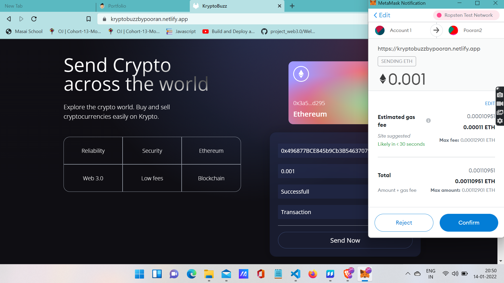
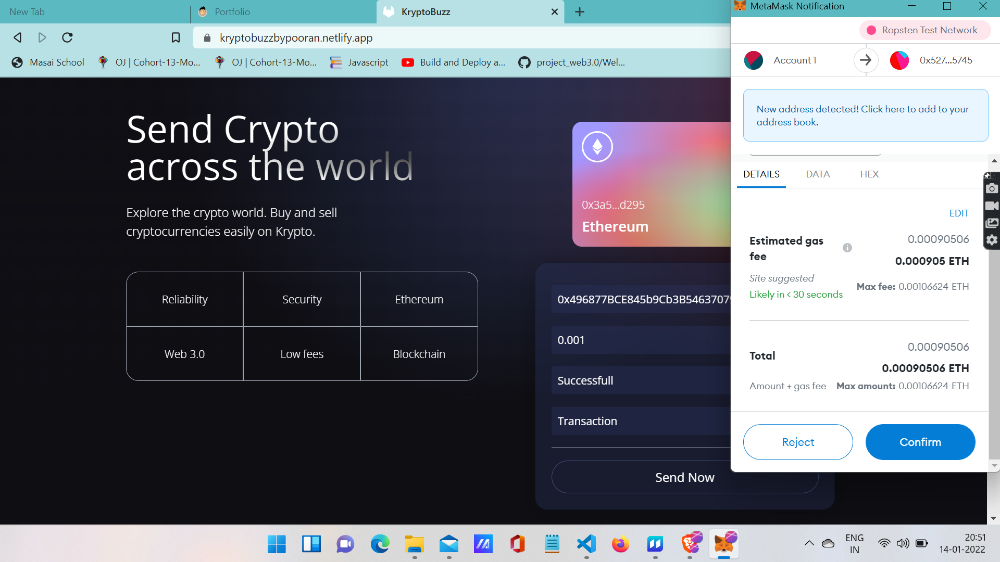
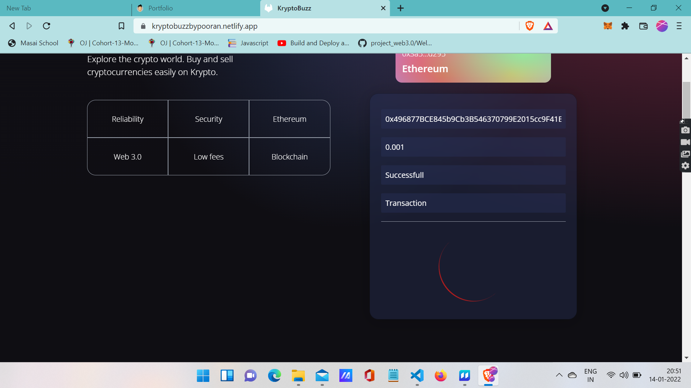
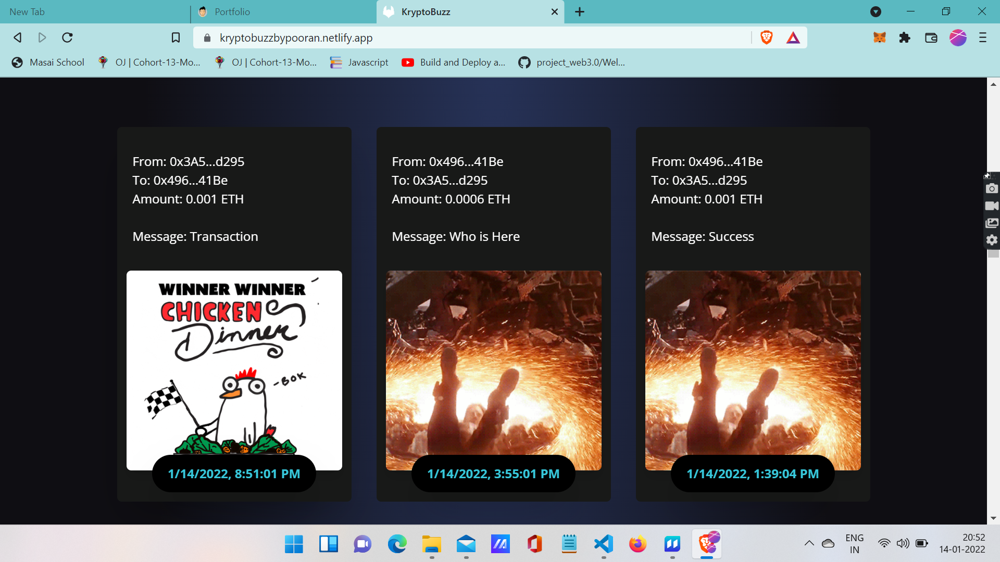
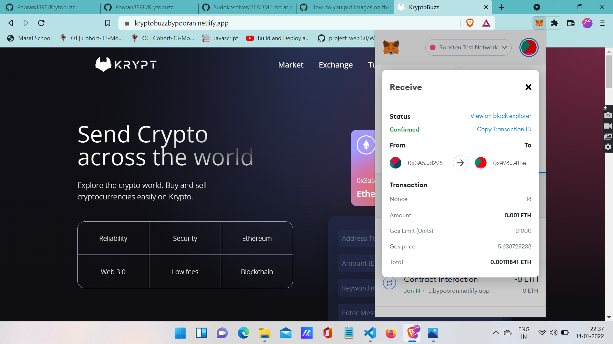

# KryptoBuzz

### KryptoBuzz is a website that helps you transfer the Ethereum from one wallet to another wallet. with the help of metamask you can carryout the successfull transaction.

# Technologies used 
* [React]
* [chai]
* [ethereum-waffle]
* [ethers]
* [hardhat]
* [@nomiclabs/hardhat-ethers]
* [@nomiclabs/hardhat-waffle]
* [ethers]
* [uuid]

# Steps to Browse the Projects
### 1. Start the app in your VS code with command npm start and before that you should have the metmask install as an extension. also an account should be created on metamask.
#

### 2. After that there is an option to connect the account so you will click on that and you can connect the metamask account. After connecting with metamask you can fill all the details that are required to do the transaction. Click on Send Now
#

### 3. After clicking an option by metamask will pop-up stating the amount and gas that you will need to transfer from one address to other. So you will simply click on confirm
#

### 4. After confirmation it will get connected with the contract that we created to carry out the transaction on blockchain. There on that pop-up also you will have to simply click on confirm
#

### 5. After that the transaction has been shared to blockchain through smartcontract and it will take time from 20sec to 1minutes to successfully complete this transaction. And there will be a spinning loader at the button until the transaction is in process.
#

### 6. All the input fields will be empty now and below you can find your transaction details in the latest transactions and you can check in the reciever's wallet too. You will find the details of that transaction
#

#

#### So this was our project I have created with my efforts. I have added the screensots for our audience to understand easily.

#### ## Thank you for giving it a read....

