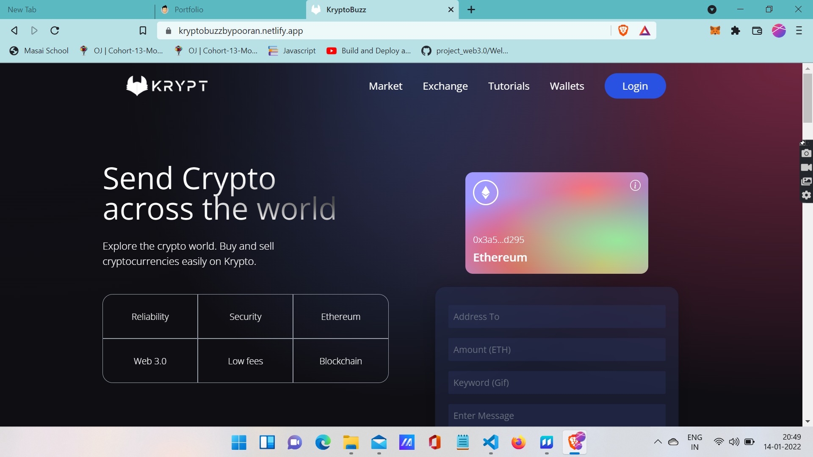
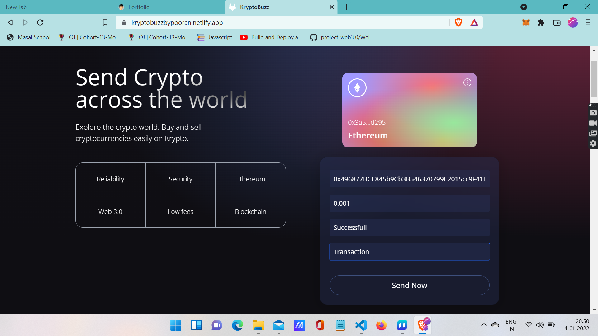

# KryptoBuzz

### KryptoBuzz is a website that helps you transfer the Ethereum from one wallet to another wallet. with the help of metamask you can carryout the successfull transaction.

# Technologies used 
* [React]
* [chai]
* [ethereum-waffle]
* [ethers]
* [hardhat]
* [@nomiclabs/hardhat-ethers]
* [@nomiclabs/hardhat-waffle]
* [ethers]
* [uuid]

# Steps to Browse the Projects
### 1. Start the app in your VS code with command npm start and before that you should have the metmask install as an extension. also an account should be created on metamask.
#

### 2. After that there is an option to connect the account so you will click on that and you can connect the metamask account. After connecting with metamask you can fill all the details that are required to do the transaction.
#

